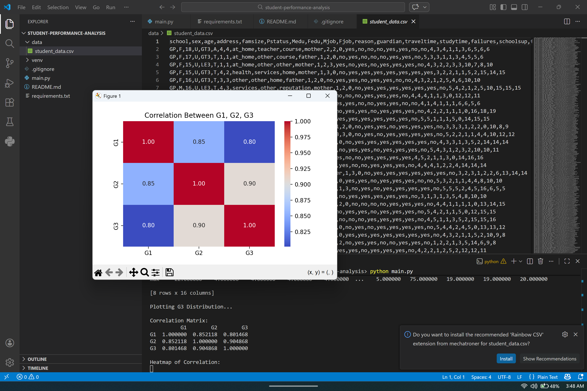

# 🎓 Student Performance Analysis & Prediction

A complete end-to-end Machine Learning project performing Exploratory Data Analysis (EDA) and predicting student final grades using Linear Regression.

---

## 🚀 Project Highlights

- End-to-end ML workflow
- Data Cleaning & Preprocessing
- Exploratory Data Analysis (EDA)
- Correlation Analysis
- Linear Regression Modeling
- Model Evaluation (R², MSE)
- Data Visualization using Seaborn & Matplotlib

---

## 📊 Model Performance

- R² Score: 0.79
- Mean Squared Error: 4.17
- Average Prediction Error: ~2 Marks

---
## 📊 Sample Visualization

